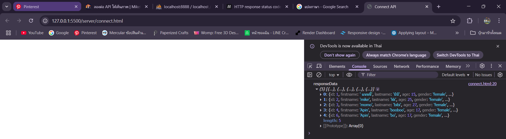

# MySQL จาก nodejs 
(ใช้ไฟล์เดิมต่อจาก ep_9)
link lec พี่ไมค์ [ep.10](https://docs.mikelopster.dev/c/web101/chapter-10/intro)

## HTTP response status codes
* Informational responses (100 – 199)
* Successful responses (200 – 299)
* Redirection messages (300 – 399)
* Client error responses (400 – 499)
* Server error responses (500 – 599)

[ref](https://developer.mozilla.org/en-US/docs/Web/HTTP/Reference/Status)


## note
* ```npm install mysql``` library ที่ node จะคุยกับ MySQL 

## code ที่เชื่อม MySQL <-----> nodejs แบบที่ 1
```js
//import library
const express = require('express') 
const bodyparser = require('body-parser')
const mysql = require('mysql2/promise') 

const app = express()
app.use(bodyparser.json())

const port = 8000 //port server

/*-------------- async await ---------------*/
app.get('/testdb-new', async (req, res) => {
  try {
    const conn = await mysql.createConnection({
    host: 'localhost',
    user: 'root',
    password: 'root',
    database: 'tutorials', //ใส่ชื่อ data base
    port: 8889 //port data base
  })
  const results = await conn.query('SELECT * FROM user') 
  res.json(results[0])
  } catch (error) {
    console.error('Error fetching users:', error.message)
    res.status(500).json({ error: 'Error fetching users' }) 
  }
})
/*-----------------------------------------*/

//output terminal
app.listen(port, (req, res) => {
  console.log('http server run at ' + port)
})
```

### การทำ promise
```js
app.get('/testdb', (req, res) => {
  mysql.createConnection({
    host: 'localhost',
    user: 'root',
    password: 'root',
    database: 'tutorials', //ใส่ชื่อ data base
    port: 8889
  }).then((conn) => {
    // สิ่งนี้เราเรียกกันว่า promise
    conn
    .query('SELECT * FROM user') //ใส่ชื่อ from
    .then((results) => {
      res.json(results[0])
    })
    .catch((error) => {
      console.error('Error fetching users:', error.message)
      res.status(500).json({ error: 'Error fetching users' }) //500 คือ status code
    })
  })
})
```
### async await แทนการทำ promise
#### same result
```js
app.get('/testdb-new', async (req, res) => {
  try {
    const conn = await mysql.createConnection({
    host: 'localhost',
    user: 'root',
    password: 'root',
    database: 'tutorials', //ใส่ชื่อ data base
    port: 8889
  })
  const results = await conn.query('SELECT * FROM user') 
  res.json(results[0])
  } catch (error) {
    console.error('Error fetching users:', error.message)
    res.status(500).json({ error: 'Error fetching users' }) 
  }
})
```

## code ที่เชื่อม MySQL <-----> nodejs แบบที่ 2
#### เปลี่ยน connnection เป็น function เพื่อที่ทุก method จะได้เรียกใช้ conn ได้

```js
//import library
const express = require('express') 
const bodyparser = require('body-parser')
const mysql = require('mysql2/promise')

const app = express()
app.use(bodyparser.json())

const port = 8000

/*
GET /users สำหรับ get users ทั้งหมดที่บันทึกเข้าไปออกมา
POST /users สำหรับการสร้าง users ใหม่บันทึกเข้าไป
GET /users/:id สำหรับการดึง users รายคนออกมา
PUT /users/:id สำหรับการแก้ไข users รายคน (ตาม id ที่บันทึกเข้าไป)
DELETE /users/:id สำหรับการลบ users รายคน (ตาม id ที่บันทึกเข้าไป)
*/

let conn = null

const initMySQL = async () => {
  conn = await mysql.createConnection({
    host: 'localhost',
    user: 'root',
    password: 'root',
    database: 'tutorials', //ใส่ชื่อ data base
    port: 8889
  })
}


//path = GET /users สำหรับ get users ทั้งหมดที่บันทึกเข้าไปออกมา
app.get('/users', async (req, res) => {
  const results = await conn.query('SELECT * FROM user') 
    res.json(results[0])
})


//output terminal
app.listen(port, async (req, res) => {
  await initMySQL()
  console.log('http server run at ' + port)
})
```

## รวมคำสั่ง query ที่เจอใน woekshop
ระวังอย่าสะกดผิด ที่อยู่ใน ```(' ')``` คือคำสั่ง
1. GET   
    const results = await conn.query('SELECT * FROM'```<ชื่อ Table>```)

    **ตัวอย่าง** 
    ```const results = await conn.query('SELECT * FROM user')```

    ----------------------------

2. POST  
    const results  = await conn.query('INSERT INTO ```<ชื่อ Table>``` SET ?', ```<ตัวแปรที่ดึงข้อมูลมาเก็บ จะถูกแทนที่ในตำแหน่ง ?>```)

    **ตัวอย่าง** 
    ```const results  = await conn.query('INSERT INTO user SET ?', userData)```   

    ----------------------------

3. PUT 
    const results  = await conn.query('UPDATE ```<ชื่อ Table>``` SET ? WHERE id = ?', [updateUser , id])

    **ตัวอย่าง** 
    ```const results  = await conn.query('INSERT INTO user SET ?', userData)```

    ----------------------------

4. DELETE  ไอเดียเดียวกับ PUT

    **ตัวอย่าง**
    ```const results  = await conn.query('DELETE FROM user WHERE id = ?', id)```

## ลองต่อกับหน้าบ้าน
1. ```npm install cors ``` library

2. ไปเพิ่ม library
```js
//import library
const express = require('express') 
const bodyparser = require('body-parser')
const mysql = require('mysql2/promise')
const cors = require('cors')


const app = express()
app.use(bodyparser.json())
app.use(cors())
```

3. สร้างไฟล์ connect.html code script จาก [doc พี่ไมค์](https://docs.mikelopster.dev/c/web101/chapter-10/bonus)
```html
<!DOCTYPE html>
<html lang="en">

<head>
    <meta charset="UTF-8">
    <meta name="viewport" content="width=device-width, initial-scale=1.0">
    <title>Connect API</title>
</head>

<body>

    <script>
        fetch('http://localhost:8000/users') // /users --> path API
            .then((response) => {
                return response.json()
            })
            .then((responseData) => {
                console.log('responseData', responseData)
            })
    </script>
</body>

</html>
```

**ถ้าต่อถูก จะได้**
