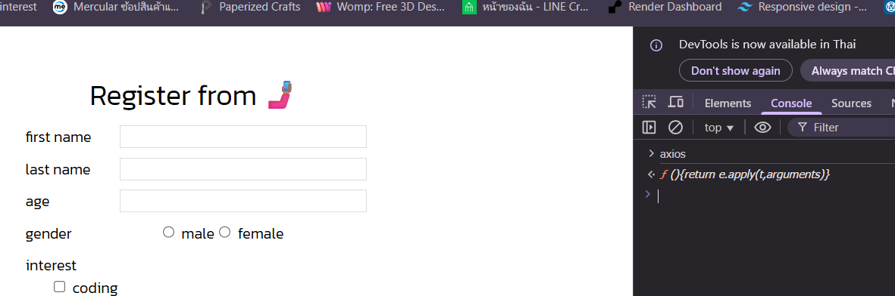

# การดึง API มาใช้ใน Frontend
link lec พี่ไมค์ [ep.11](https://docs.mikelopster.dev/c/web101/chapter-11/intro)

## จาก fetch() เปลี่ยนมาใช้ axios
1. install [axios](https://www.npmjs.com/package/axios#cdn) ไป cop link cdn มาวาง
2. ที่ไฟล์ index.html วาง link
```html
<!-- JS -->
     <script src="https://cdn.jsdelivr.net/npm/axios@1.6.7/dist/axios.min.js"></script> //cdn
     <script src="index.js"></script>
    </body>
```
3. ลองใช้คำสั่ง ```axios``` ที่ console ถ้าถูกจะได้


